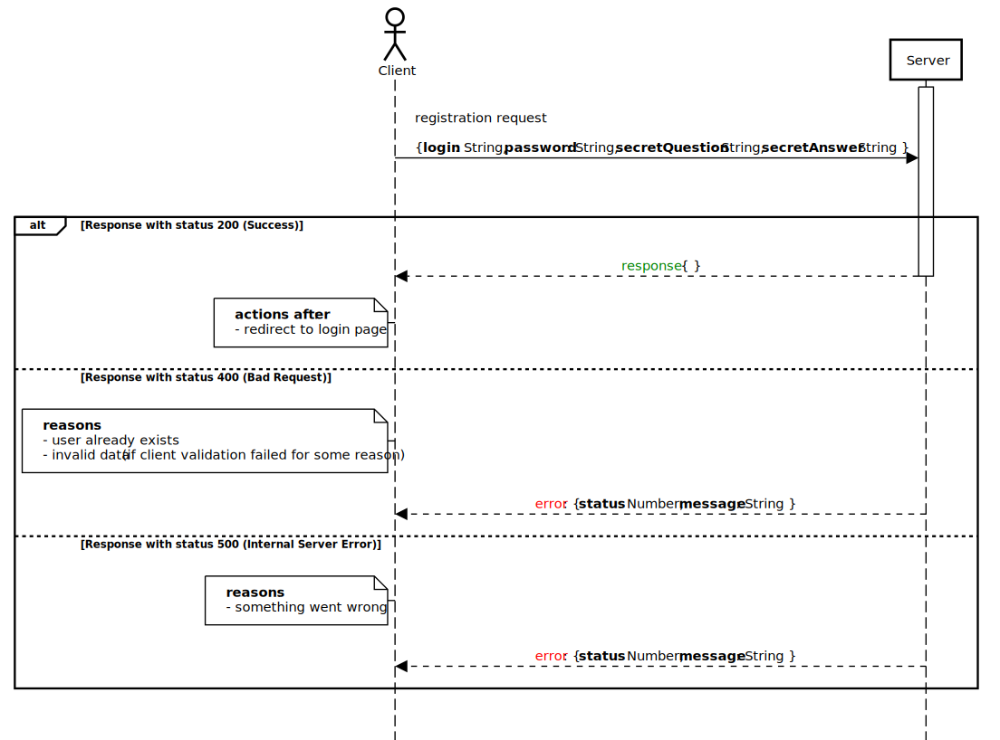
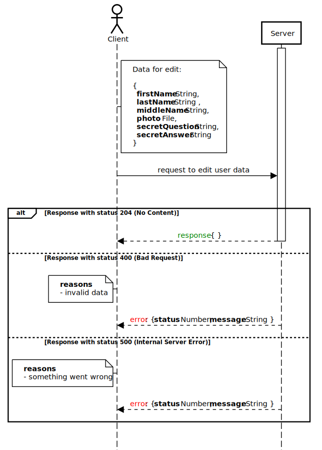
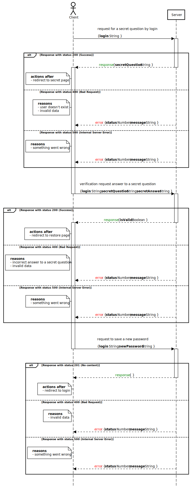
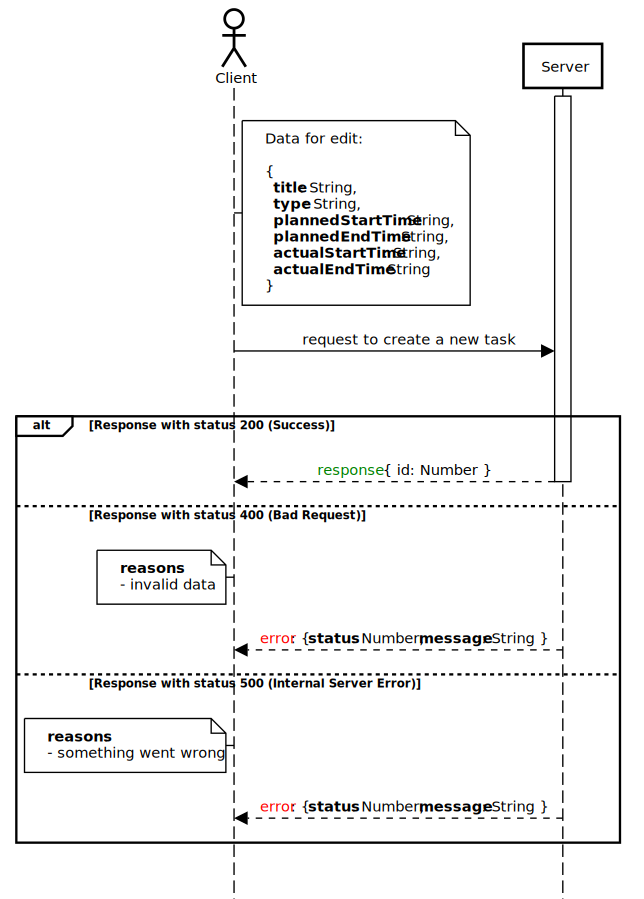
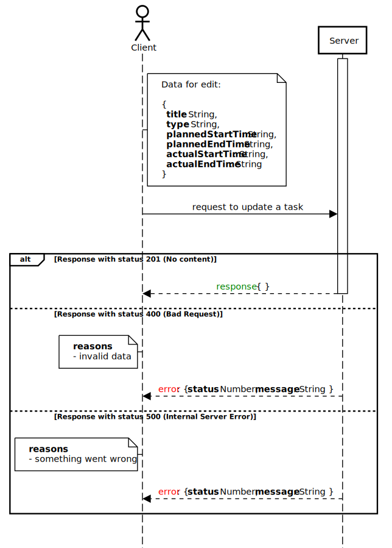
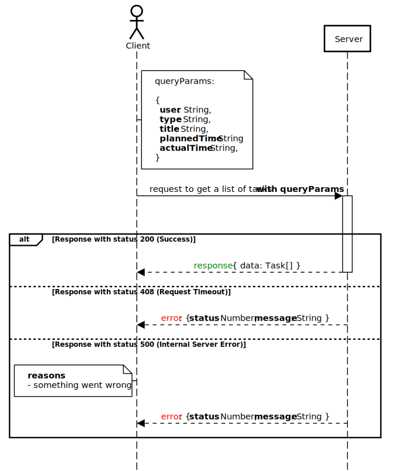

## Scenarios

* [Auth and Session](#auth-and-session)
* [Сreating a new user](#сreating-a-new-user)
* [Editing a user profile](#editing-a-user-profile)
* [Password](#password)
* [Сreating a new task](#creating-a-new-task)
* [Editing a task](#editing-a-task)
* [Getting task list (filter)](#getting-task-list-(filter))

---

### Auth and Session

---

### Сreating a new user

---

### Editing a user profile

---

### Password

---

### Сreating a new task

---

### Editing a task

---

### Getting task list (filter)

